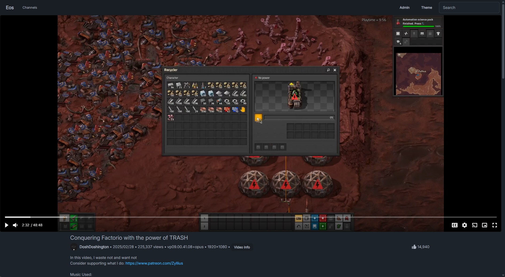

# Eos

A simple server to import and serve your YouTube archive. 

I rewrite this application peridocally to learn new technologies. This time around I experimented with [River](https://riverqueue.com/) and [HTMX](https://htmx.org/).




## Setup

Files must be in the following format to be imported:

```
/data/videos/<CHANNEL>/<VIDEO>/<VIDEO FILES>
```

```
/data/videos
└── DoshDoshington
    └── DoshDoshington - 20250301 - Conquering_Factorio_with_the_power_of_TRASH
        ├── DoshDoshington - 20250301 - Conquering_Factorio_with_the_power_of_TRASH [skGweruLxjI].description
        ├── DoshDoshington - 20250301 - Conquering_Factorio_with_the_power_of_TRASH [skGweruLxjI].en-en-US.vtt
        ├── DoshDoshington - 20250301 - Conquering_Factorio_with_the_power_of_TRASH [skGweruLxjI].en-orig.vtt
        ├── DoshDoshington - 20250301 - Conquering_Factorio_with_the_power_of_TRASH [skGweruLxjI].en-US.vtt
        ├── DoshDoshington - 20250301 - Conquering_Factorio_with_the_power_of_TRASH [skGweruLxjI].en.vtt
        ├── DoshDoshington - 20250301 - Conquering_Factorio_with_the_power_of_TRASH [skGweruLxjI].info.json
        ├── DoshDoshington - 20250301 - Conquering_Factorio_with_the_power_of_TRASH [skGweruLxjI].mkv
        └── DoshDoshington - 20250301 - Conquering_Factorio_with_the_power_of_TRASH [skGweruLxjI].webp
```

```yaml
services:
  eos:
    image: ghcr.io/zibbp/eos:dev
    restart: unless-stopped
    environment:
      - TZ=America/Chicago
      - DEBUG=true
      - DB_HOST=eos-db
      - DB_PORT=5432
      - DB_USER=eos
      - DB_PASS=PASSWORD
      - DB_NAME=eos
      - VIDEOS_DIR=/data/videos
      - MAX_VIDEO_IMPORT_WORKERS=50
    volumes:
      - /path/to/videos:/data/videos
    ports:
      - 4900:3000
    depends_on:
      - eos-db
  eos-worker:
    image: ghcr.io/zibbp/eos-worker:dev
    restart: unless-stopped
    environment:
      - TZ=America/Chicago
      - DEBUG=true
      - DB_HOST=eos-db
      - DB_PORT=5432
      - DB_USER=eos
      - DB_PASS=PASSWORD
      - DB_NAME=eos
      - VIDEOS_DIR=/data/videos
      - MAX_VIDEO_IMPORT_WORKERS=50
    volumes:
      - /path/to/videos:/data/videos
    depends_on:
      - eos-db
  eos-db:
    container_name: eos-db
    restart: unless-stopped
    image: postgres:17
    volumes:
      - ./db:/var/lib/postgresql/data
    environment:
      - POSTGRES_PASSWORD=PASWORD
      - POSTGRES_USER=eos
      - POSTGRES_DB=eos
    ports:
      - 4901:5432
```

## Development

Clone and setup the devcontainer. Use `make dev-web` to run the Go server and frontend with hot reloading. Use `make dev-worker` to run the worker.

`.env` file:
```
DB_HOST=localhost
DB_PORT=5432
DB_USER=postgres
DB_PASS=postgres
DB_NAME=postgres

VIDEOS_DIR=/data/videos

MAX_VIDEO_IMPORT_WORKERS=1
```
